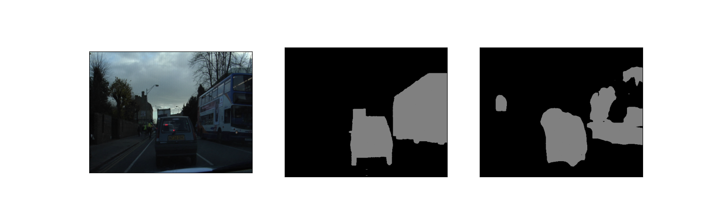
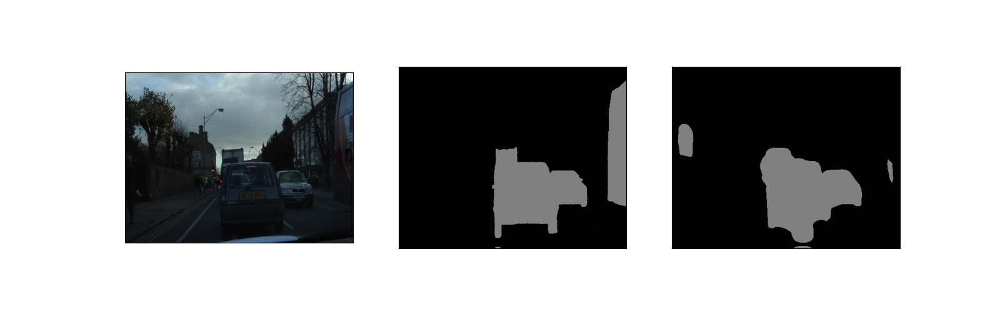
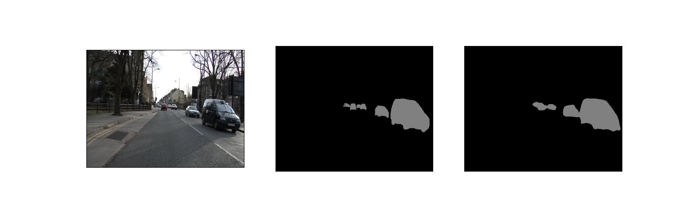
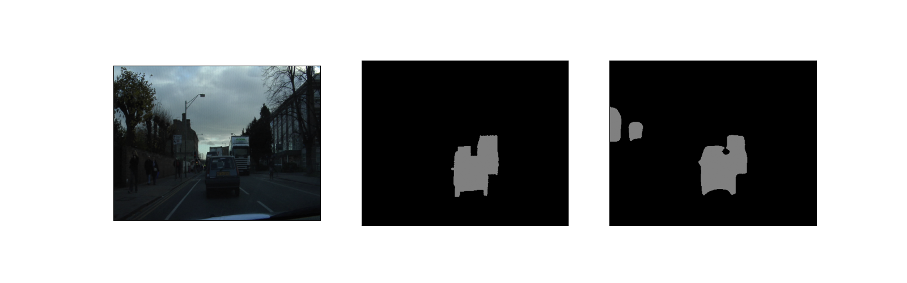

# PSPNet with RepVGG Backbone
The model is structured with a RepVGG encoder with a PSPNet decoder. Dice loss was utilized for the segmentation head. No auxiliary loss for the encoder output was implemented.

The model is still slightly less accurate compared to mobilenetv1 on the same training hyperparameters (same training script). I will try to add weight decay later. 

I also make a convert file to convert training-time model to inferrence-time model the output of both are equivalent.
<br>

### Results
I tried to train many model repvggA0_g8, repvggA0_g16, repvggA1_g8, repvggA2_g16. The best model were repvggA2_g16 and repvggA1_g8. 
mobilev1
- Train IoU ~0.72
- Valid IoU ~0.52

repvggA2_g16 and repvggA1_g8
- Train IoU ~0.75
- Valid IoU ~0.5

Below are the test results







---

## Training
The directory structure for image data should be as follows
```
Foo
|-- images
|   |-- train
|   |-- valid
|   |-- test
|
|-- masks
|   |-- train
|   |-- valid
|   |-- test
```

### Training command
```
python main.py --input path/to/images --masks path/to/masks
```

### Tensorboard
Tensorboard logs are saved under ./logs by date.
```
tensorboard --logdir /logs/some_dir
```
